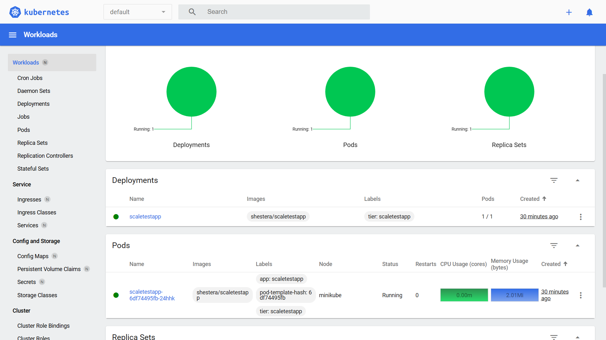
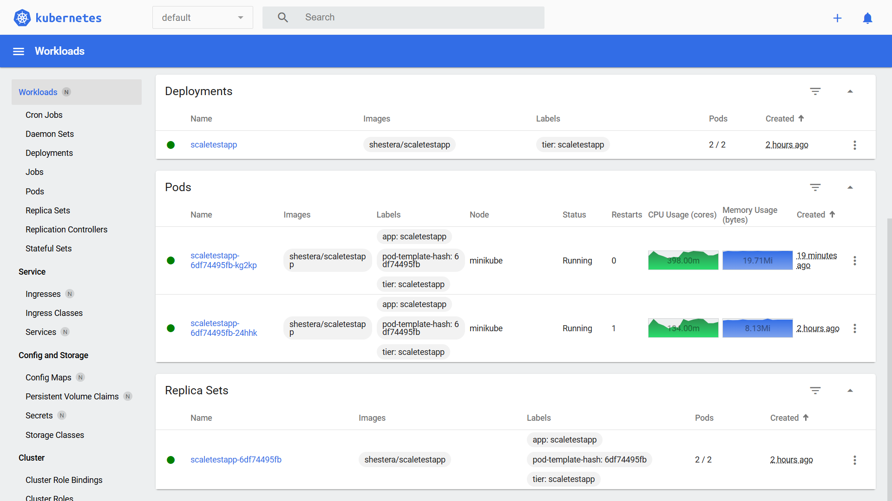

# Задание 2

## Запуск кластера

```bash
minikube start --vm-driver=virtualbox --addons=metrics-server --no-vtx-check --memory=8192 --cpus=4
```

## Запуск сервиса

Настройка и запуск сервиса

```bash
kubectl apply -f deployment.yaml

kubectl apply -f service.yaml

minikube service scaletestapp --url
```

## Настройки масштабирования

```bash
minikube addons enable metrics-server

kubectl apply -f hpa.yaml
```

## Результаты

До нагрузки: 

Во время нагрузки: 
